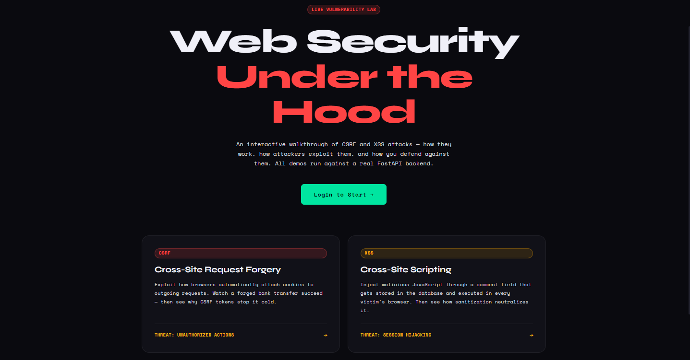

# Security Showcase — CSRF & XSS

A full-stack interactive lab that demonstrates CSRF and XSS vulnerabilities side by side with their mitigations. Built with **FastAPI** (Python) on the backend and **Vue 3 + Vite** on the frontend.

---

## What This Project Demonstrates



### CSRF (Cross-Site Request Forgery)

| Endpoint | Protection |
|---|---|
| `POST /api/csrf/transfer/vulnerable` | None — accepts any request with a valid session cookie |
| `POST /api/csrf/transfer/secure` | Validates a CSRF token against the server-side session |

You can trigger a "forged" transfer from the UI and watch the vulnerable endpoint accept it, then try the same against the protected endpoint and see it rejected with 403.

### XSS (Cross-Site Scripting — Stored)

| Endpoint | Protection |
|---|---|
| `POST /api/xss/comment/vulnerable` | None — raw content stored and rendered as HTML |
| `POST /api/xss/comment/secure` | Sanitized with `bleach` before storage; rendered with `v-text` |

The UI provides pre-built XSS payloads (`<script>` tags, `onerror` handlers) to paste into the comment form. The vulnerable panel executes them; the protected panel shows the sanitized output alongside the raw input so you can compare.

## Getting Started

### Prerequisites

- Python 3.11+
- Node.js 18+

---

### Backend Setup

```bash
cd backend

# Create and activate a virtual environment
python -m venv .venv
source .venv/bin/activate        # Windows: .venv\Scripts\activate

# Install dependencies
pip install -r requirements.txt

# Copy the env file (optional — defaults work for local dev)
cp .env.example .env

# Start the server
uvicorn main:app --reload --port 8000
```

The API will be available at `http://localhost:8000`.  
Swagger docs at `http://localhost:8000/docs`.

---

### Frontend Setup

```bash
cd frontend

# Install dependencies
npm install

# Start the dev server
npm run dev
```

The app will be available at `http://localhost:5173`.

The Vite dev server proxies all `/api` requests to `http://localhost:8000`, so cookies work correctly across the proxy boundary.

---

### Test Accounts

Both accounts use the password `password123`.

| Username | Balance |
|---|---|
| `alice` | $10,000 |
| `bob` | $5,000 |

---

## How to Run Each Demo

### CSRF Demo

1. Log in as `alice`.
2. Navigate to the **CSRF** page.
3. On the **Vulnerable** panel, click **"Simulate Forged Request"** — a transfer to `attacker` for $9,999 is sent without any CSRF token and the server accepts it.
4. On the **Protected** panel, click **"Try Forged Request (Should Fail)"** — the server rejects the fake token with a 403.
5. Check the Transfer Log to see both attempts recorded with their protection method.

### XSS Demo

1. Log in and navigate to the **XSS** page.
2. On the **Vulnerable** panel, click one of the pre-built payloads (e.g. **"Alert popup"**).
3. Submit the comment — the script executes immediately in your browser.
4. Switch to the **Protected** panel, submit the same payload.
5. Observe the diff: the raw input vs the sanitized output that was actually stored.

---

## Key Security Concepts

### CSRF Token Flow

```
Login → Server generates random token → Stored in session
         ↓
Frontend reads token from /api/auth/me response
         ↓
Every mutating request includes token in request body
         ↓
Server compares body token with session token → match = allow, mismatch = 403
```

An attacker on `evil.com` cannot read your session cookie or the CSRF token stored in it due to the Same-Origin Policy. So any forged request they fire will carry no token (or a fake one), and the server rejects it.

### XSS Sanitization (bleach)

```python
import bleach

ALLOWED_TAGS = ["b", "i", "u", "em", "strong", "p", "br"]

sanitized = bleach.clean(
    user_input,
    tags=ALLOWED_TAGS,
    attributes={},
    strip=True,         # strip disallowed tags entirely (don't escape them)
)
```

Input: `<script>alert(document.cookie)</script><b>hello</b>`  
Output: `hello` (script stripped, bold preserved)

---

## Production Hardening Checklist

These are intentionally omitted from this demo for clarity, but required in production:

- [ ] Replace in-memory store with a real database (PostgreSQL, etc.)
- [ ] Hash passwords with `bcrypt` — never store plaintext
- [ ] Set `SESSION_SECRET` to a cryptographically random 64-char string
- [ ] Enable `SameSite=Strict` and `Secure` on session cookies
- [ ] Add a Content Security Policy header: `script-src 'self'`
- [ ] Add `X-Content-Type-Options: nosniff` and `X-Frame-Options: DENY`
- [ ] Rate-limit auth endpoints
- [ ] Use HTTPS in all environments beyond local dev

---

## Tech Stack

| Layer | Technology |
|---|---|
| Backend framework | FastAPI |
| Session management | Starlette `SessionMiddleware` |
| HTML sanitization | `bleach` |
| Frontend framework | Vue 3 (Composition API) |
| Build tool | Vite |
| State management | Pinia |
| Routing | Vue Router |
| HTTP | Native `fetch` with `credentials: include` |